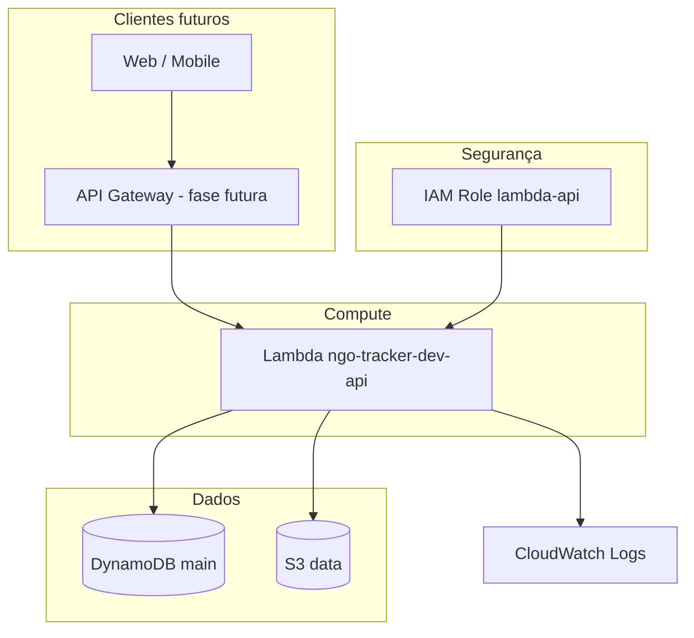

# ngo-tracker-tf

Infraestrutura como código (Terraform) do projeto NGO Tracker, com suporte a desenvolvimento local via LocalStack (custo zero).

## Arquitetura

A API Lambda é o ponto central: CRUD de ONGs, registro de doações e gastos no DynamoDB, comprovantes no S3.

## Documentação

- [Checklist](docs/CHECKLIST.md) - andamento do projeto (o que foi feito e o que falta)
- [API REST](docs/API.md) - rotas, payloads e testes no LocalStack
- [Postman](docs/POSTMAN.md) - collection para testes via API Gateway (AWS)
- [Deploy AWS](docs/DEPLOY_AWS.md) - sair do LocalStack e provisionar na nuvem
- [Frontend](docs/FRONTEND.md) - painel web (`frontend/`)
- [Nomenclatura padrão](docs/NOMENCLATURA_PADRAO.md) - convenções de naming de recursos
- [Infra da aplicação](docs/INFRASTRUCTURE.md) - S3, DynamoDB, IAM, Lambda
- [Implementação do Terraform](docs/TERRAFORM_IMPLEMENTATION.md) - mais detalhes do que foi feito no projeto e justificativa das escolhas
- [Rodar localmente](docs/RODAR_LOCALMENTE.md) - passo a passo para subir Docker/LocalStack e ter a infra rodando localmente
- [Operação e CI](docs/OPERACAO_E_QUALIDADE.md) - Docker Compose, API Gateway, GitHub Actions, AWS real

## O projeto

Criar este projeto foi uma ideia que tive a partir da necessidade de me realocar no mercado de trabalho. Sem formação acadêmica, mas auto-didata com 3 anos de experiência em uma empresa de grande porte, senti a dificuldade de comprovar minhas habilidades de modo a driblar a triagem inicial de currículo feita por IAs e sistemas de filtro de candidaturas.

Assim, resolvi desenvolver um projeto *do zero* que permitisse mostrar tudo o que sou capaz de fazer e decidir em termos de infra e DevOps, para ter um portfólio robusto para apresentar nos processos seletivos.

Acompanha-me! Vem aprender infra ou só ver se essa empreitada vai funcionar. :rocket: :v:

## A aplicação - NGO Tracker

Sou protetor de animais e já voluntariei em ONG de resgate. Quando não podia voluntariar, colaborava mensalmente para um projeto que acompanhava no Instagram, porque sei o quanto doações fazem a diferença no dia-a-dia da pessoa protetora de animais.

Um (nada) belo dia, porém, descobri que aquele projeto era uma fraude! Um grupo de mulheres que forjava resgates com imagens de grupos do Facebook estava por trás do esquema. Elas recolhiam as doações e usavam tudo para benefício próprio.

Hoje, para estudar infra-estrutura e DevOps a partir de um projeto "_hands-on_", resolvi criar uma aplicação que permite que as ONG's prestem auditoria dos seus gastos e das doações recebidas. A ideia é que Organizações de resgate animal idôneas possam ser reconhecidas pelas pessoas que pretendem fazer doações, estimulando assim as suas ações e agilizando suas operações.

## Repositório

https://github.com/colorisaw/ngo-tracker-tf
