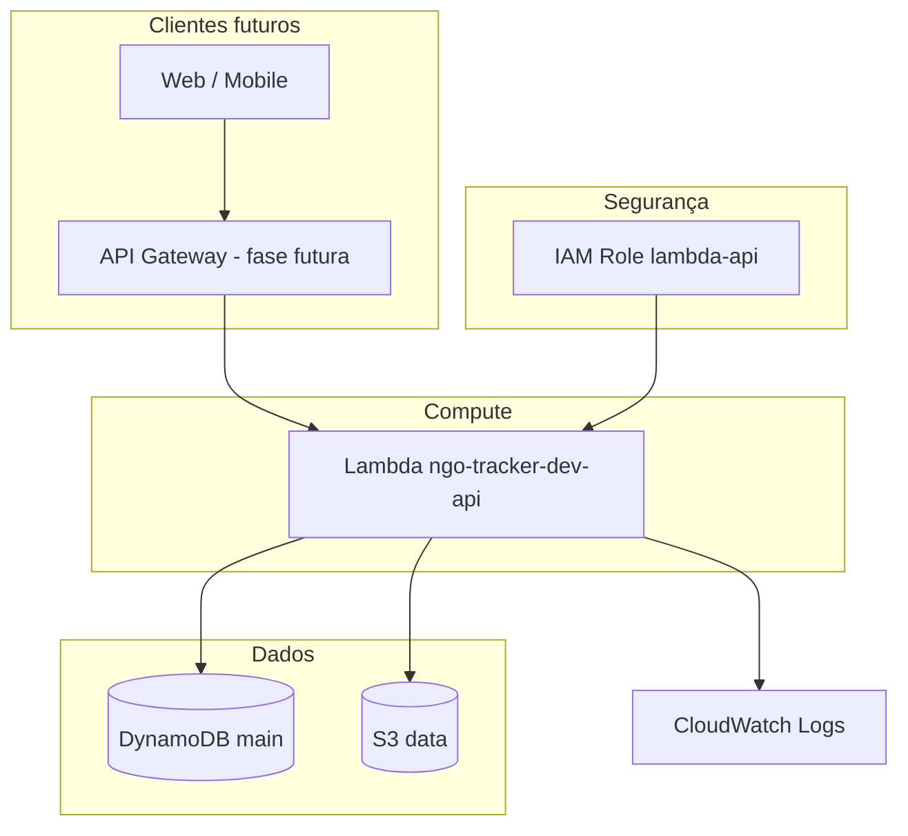

# Infraestrutura da aplicação

Arquitetura **serverless** para o NGO Tracker (adequada ao LocalStack e à AWS real).

---

## Índice

1. [Visão geral da arquitetura](#visão-geral-da-arquitetura)
2. [Decisões técnicas — por mudança](#decisões-técnicas--por-mudança)
3. [Recursos criados](#recursos-criados)
4. [Modelo de dados DynamoDB](#modelo-de-dados-dynamodb)
5. [O que foi adiado e por quê](#o-que-foi-adiado-e-por-quê)
6. [Migração do bucket da Fase 2](#migração-do-bucket-da-fase-2)
7. [Comandos e validação](#comandos-e-validação)

---

## Visão geral da arquitetura



A API (hoje um placeholder em Python) é o ponto central: lê/escreve auditoria de ONGs e doações no DynamoDB e armazena anexos/relatórios no S3.

---

## Decisões técnicas — por mudança

### 1. Arquitetura serverless (Lambda + DynamoDB + S3)

**O quê:** Compute via Lambda, dados em DynamoDB e arquivos em S3 — sem servidores EC2 nem cluster Kubernetes nesta fase.

**Por quê:**

| Critério | Serverless | Alternativa (EKS/EC2) |
|----------|------------|------------------------|
| Custo em dev | Funciona bem no LocalStack; paga só pelo uso na AWS | Cluster caro mesmo parado |
| Complexidade | Menos peças para aprender e manter no portfólio | VPC, nodes, ingress, mais moving parts |
| Caso de uso NGO Tracker | API com picos moderados, CRUD + uploads | EKS só se houver microsserviços pesados ou estado em memória |

**Trade-off aceito:** limite de tempo/memória da Lambda e cold start — aceitável para API de auditoria e MVP.

---

### 2. Remoção de `aws-storage.tf` e bucket `sre-terraform-state`

**O quê:** Arquivo único da Fase 2 removido; bucket renomeado e repaginado em `storage.tf`.

**Por quê:**

- **`sre-terraform-state`** confundia **dados da aplicação** com **state do Terraform** (que já vive em `sre-terraform-state-local` no backend).
- Naming genérico não escalava para `staging` / `prod` nem identificava o produto.
- Separar arquivos por domínio (`storage.tf`, `dynamodb.tf`, …) é padrão Terraform: cada arquivo = um bounded context, reviews e `plan` mais legíveis.

**Impacto no `apply`:** se o bucket antigo ainda estiver no state, o Terraform propõe **destroy** do recurso antigo e **create** do novo — correto em `dev`; em produção exigiria migração de objetos antes.

---

### 3. Variável `project_name` e `local.name_prefix`

**O quê:**

```hcl
name_prefix = "${var.project_name}-${var.environment}"
# Ex.: ngo-tracker-dev
```

**Por quê:**

- **Um único lugar** para mudar o prefixo de todos os recursos (`ngo-tracker` → outro nome de produto).
- **`environment`** no nome evita colisão entre `dev`, `staging` e `prod` na mesma conta AWS.
- Convenção `{projeto}-{ambiente}-{função}` é reconhecida em FinOps (cost allocation) e em buscas no console AWS.
- Validação regex em `project_name` / `environment`: S3 e vários recursos AWS **exigem nomes em minúsculas** sem caracteres especiais — falhar no `plan` é melhor que falhar no `apply`.

**Tags:** `Project = local.project_name` (antes `sre-terraform`) alinha custos e inventário ao produto real **ngo-tracker**.

---

### 4. Arquivos separados (`storage.tf`, `dynamodb.tf`, `iam.tf`, `lambda.tf`, `outputs.tf`)

**O quê:** Um recurso principal por arquivo, em vez de um único `.tf` monolítico.

**Por quê:**

| Benefício | Explicação |
|-----------|------------|
| Legibilidade | Quem mexe em IAM não precisa abrir Lambda |
| Ownership | Em time, PRs menores por domínio |
| Reuso futuro | Módulos podem extrair `storage.tf` inteiro depois |
| Blast radius | Erro de sintaxe em `lambda.tf` não mistura com DynamoDB no diff |

Não criamos **módulos Terraform** ainda — YAGNI: o root module ainda é pequeno; módulos entram quando houver segundo ambiente ou repetição.

---

### 5. S3 — `storage.tf`

#### 5.1 Bucket `${name_prefix}-data`

**Função:** anexos de comprovantes, exports de auditoria, PDFs/imagens que não pertencem ao DynamoDB.

**Por quê S3 e não só DynamoDB:** objetos grandes e binários são caros e lentos em item DynamoDB; S3 é o serviço certo para blob storage.

#### 5.2 Versioning habilitado

**Por quê:** auditoria de ONGs exige **rastreabilidade** — versioning permite recuperar versão anterior de um comprovante se alguém sobrescrever por engano.

**Trade-off:** mais storage; em `dev` no LocalStack o impacto é irrelevante.

#### 5.3 Criptografia SSE-S3 (AES256)

**Por quê:** dado em repouso criptografado por padrão; requisito comum em checklist de segurança e LGPD-adjacent (boas práticas). AES256 é nativo S3, sem custo de KMS separado no MVP.

#### 5.4 `public_access_block` em todos os flags

**Por quê:** bucket de dados de ONGs **não deve ser público**. Bloqueio evita configuração acidental (`ACL public-read`) que vazaria documentos. Acesso via API/Lambda com IAM, não URL pública anônima.

---

### 6. DynamoDB — `dynamodb.tf`

#### 6.1 Single-table design (pk + sk)

**O quê:** Uma tabela `main` com chave composta `pk` (partition) e `sk` (sort).

**Por quê:**

- NGO Tracker tem várias entidades (ONG, doação, gasto, usuário) — multi-table exige joins que DynamoDB não tem.
- **Single-table** permite transações e queries relacionais com padrões `PK/SK` (ex.: `NGO#123` + `METADATA`, `NGO#123` + `DONATION#456`).
- Padrão recomendado pela AWS para aplicações DynamoDB-first; escala com GSI sem proliferar tabelas.

**Exemplos de chaves (aplicação futura):**

| pk | sk | Significado |
|----|-----|-------------|
| `NGO#abc` | `PROFILE` | Perfil da ONG |
| `NGO#abc` | `DONATION#xyz` | Doação vinculada à ONG |
| `DONATION#xyz` | `AUDIT` | Linha de auditoria |

#### 6.2 `billing_mode = PAY_PER_REQUEST`

**Por quê:**

- MVP e `dev`: tráfego imprevisível e baixo — **on-demand** evita provisionar RCU/WCU.
- LocalStack não cobra; na AWS real você não paga capacidade ociosa.
- **Trade-off:** em tráfego alto e estável, provisioned pode ser mais barato — reavaliar em produção.

#### 6.3 GSI `entity-type-index` (entity_type + sk)

**Por quê:** listar “todas as ONGs” ou “todas as doações” sem `Scan` na tabela inteira. O GSI projeta `entity_type` como hash — query eficiente por tipo.

**`projection_type = ALL`:** queries no índice trazem o item completo — mais storage no índice, menos chamadas subsequentes à tabela base (simplicidade no app).

#### 6.4 `point_in_time_recovery` condicional

```hcl
enabled = !local.is_localstack
```

**Por quê:**

- Na **AWS real:** PITR permite restaurar tabela a um instante no tempo — importante para dados de auditoria.
- No **LocalStack:** suporte limitado ou desnecessário em dev — desligado evita erro ou comportamento inconsistente no emulador.

---

### 7. IAM — `iam.tf`

#### 7.1 Role dedicada `lambda-api` (não usar role default)

**Por quê:** **least privilege** — a Lambda só recebe permissões para a tabela e o bucket que o código usa, não `AdministratorAccess`.

#### 7.2 `assume_role_policy` para `lambda.amazonaws.com`

**Por quê:** contrato AWS — só o serviço Lambda pode assumir essa role em runtime.

#### 7.3 Policy inline (`aws_iam_role_policy`) vs policy attachment gerenciada

**O quê:** policy JSON embutida no Terraform, referenciando ARNs de `aws_dynamodb_table.main` e `aws_s3_bucket.app_data`.

**Por quê:**

- ARNs são **derivados do state** — se o bucket mudar, a policy acompanha no mesmo `apply`.
- Policies AWS gerenciadas (`AmazonDynamoDBFullAccess`) são amplas demais para portfólio que prega segurança.

**Permissões DynamoDB:** CRUD + Query/Scan + Batch na tabela **e** `index/*` — necessário para o GSI.

**Permissões S3:** `Get/Put/Delete Object` + `ListBucket` — upload de comprovantes e listagem de prefixos.

**Permissões Logs:** Lambda precisa escrever em CloudWatch; sem isso a função executa mas você fica “cego” em debug.

**O que não colocamos ainda:** `kms:Decrypt`, `ses:SendEmail`, `sns:Publish` — só quando a aplicação precisar.

---

### 8. Lambda — `lambda.tf` e `lambda/handler.py`

#### 8.1 Runtime `python3.12`

**Por quê:** versão suportada e moderna; alinhada ao ecossistema Python comum em APIs serverless. LocalStack e AWS suportam.

#### 8.2 Placeholder `handler.py` (não API completa ainda)

**Por quê:** Fase 3 é **infra**, não aplicação final. O placeholder prova:

- empacotamento zip correto,
- role IAM funcional,
- invoke no LocalStack,
- variáveis de ambiente injetadas.

Substituir depois por FastAPI/Flask em layer ou container image sem mudar a role (se dependências couberem no zip).

#### 8.3 `archive` provider + `.build/*.zip`

**O quê:** `data.archive_file` gera zip antes do deploy; pasta `.build/` no `.gitignore`.

**Por quê:** Lambda exige pacote zip; gerar no `plan/apply` garante que **código alterado → novo hash → update da função** (`source_code_hash`).

**Alternativa rejeitada:** zip commitado no Git — polui diff e esquece rebuild.

#### 8.4 Variáveis de ambiente na Lambda

| Variável | Por quê |
|----------|---------|
| `DYNAMODB_TABLE` | App não hardcoda nome que muda por ambiente |
| `S3_BUCKET` | Mesmo motivo |
| `ENVIRONMENT` | Logs e feature flags (`dev` vs `prod`) |

**Padrão 12-factor:** config no ambiente, não no código.

#### 8.5 `memory_size = 128`, `timeout = 30`

**Por quê:** mínimo razoável para hello-world e CRUD leve; custo baixo. Aumentar quando houver profiling (relatórios pesados).

#### 8.6 `aws_cloudwatch_log_group` explícito

**Por quê:**

- Nome previsível: `/aws/lambda/ngo-tracker-dev-api`.
- **Retention:** 1 dia no LocalStack (dev, pouco lixo), 14 dias na AWS real (debug sem custo infinito).
- `depends_on` evita race na primeira execução em alguns cenários AWS.

#### 8.7 Provider `archive` em `versions.tf`

**Por quê:** provider oficial HashiCorp para zip; `terraform init` versiona junto com `.terraform.lock.hcl` — reprodutibilidade para o time e CI.

---

### 9. `outputs.tf`

**O quê:** exporta nomes e ARNs de bucket, tabela, Lambda e role.

**Por quê:**

- Scripts e CI leem `terraform output` sem parsear state.
- Próxima fase (API Gateway, app frontend) precisa do nome da Lambda e da tabela.
- Documentação viva do que foi provisionado.

**O que não outputamos:** segredos (não há nesta fase).

---

### 10. O que **não** mudamos (de propósito)

| Item | Motivo |
|------|--------|
| `providers.tf` / LocalStack | FinOps intacto; Fase 3 reusa a mesma estratégia |
| `backend.local.hcl` | State continua em `sre-terraform-state-local` — separado dos dados da app |
| API Gateway | Camada HTTP pública fica para fase 4; reduz superfície no primeiro `apply` |
| VPC + Lambda em subnet privada | Complexidade e NAT cost; desnecessário sem RDS/EKS |
| KMS customer-managed | SSE-S3 basta no MVP; KMS entra se compliance exigir |
| RDS PostgreSQL | DynamoDB escolhido para serverless; SQL seria outro perfil de ops |

---

## Recursos criados

| Recurso | Arquivo | Naming em `dev` |
|---------|---------|-----------------|
| S3 (dados) | `storage.tf` | `ngo-tracker-dev-data` |
| DynamoDB (single-table) | `dynamodb.tf` | `ngo-tracker-dev-main` |
| IAM role (Lambda) | `iam.tf` | `ngo-tracker-dev-lambda-api` |
| Lambda (API placeholder) | `lambda.tf` | `ngo-tracker-dev-api` |
| Outputs | `outputs.tf` | — |

---

## Modelo de dados DynamoDB

Chaves:

- **pk** (hash) — ex.: `NGO#<id>`, `DONATION#<id>`
- **sk** (range) — metadado ou relação

**GSI** `entity-type-index`: consultas por `entity_type` (ex.: listar todas as ONGs).

Variáveis de ambiente na Lambda: `DYNAMODB_TABLE`, `S3_BUCKET`, `ENVIRONMENT`.

---

## O que foi adiado e por quê

### VPC / subnets

- Lambda **fora de VPC** usa serviços AWS (DynamoDB, S3) via rede gerenciada da AWS — sem ENI, sem cold start extra.
- VPC só é necessária para acessar **RDS, ElastiCache, recursos em IP privado**.
- LocalStack simula VPC de forma parcial — adiar reduz fricção no dev.

### EKS / ECS

- Orquestração de containers justifica-se com muitos serviços, tráfego estável e equipe dedicada a Kubernetes.
- NGO Tracker MVP = API + dados — Lambda cobre com menos custo operacional.

### API Gateway

- Próximo passo natural: expor HTTP público na frente da Lambda.
- Não bloqueia validar IAM, DynamoDB e S3 agora.

---

## Migração do bucket da Fase 2

| Fase 2 | Fase 3 |
|--------|--------|
| `aws-storage.tf` | `storage.tf` |
| Bucket `sre-terraform-state` | Bucket `ngo-tracker-dev-data` |
| Tags manuais | `local.common_tags` + merge |

No `terraform apply`:

- **destroy** do recurso antigo (se ainda no state),
- **create** dos recursos da Fase 3.

Esperado em desenvolvimento. Dados do bucket antigo no LocalStack não são migrados automaticamente.

---

## Comandos e validação

### Apply

```bash
terraform init -backend-config=config/backend.local.hcl
terraform plan
terraform apply
terraform output
```

### Validar no LocalStack

```bash
export AWS_ACCESS_KEY_ID=test AWS_SECRET_ACCESS_KEY=test
export AWS_DEFAULT_REGION=us-east-1

aws dynamodb describe-table --table-name ngo-tracker-dev-main \
  --endpoint-url=http://localhost:4566

aws lambda invoke --function-name ngo-tracker-dev-api \
  --endpoint-url=http://localhost:4566 /tmp/out.json && cat /tmp/out.json
```

---

## Referências rápidas

- [AWS Lambda – best practices](https://docs.aws.amazon.com/lambda/latest/dg/best-practices.html)
- [DynamoDB single-table design](https://docs.aws.amazon.com/amazondynamodb/latest/developerguide/bp-general-nosql-design.html)
- [S3 security – block public access](https://docs.aws.amazon.com/AmazonS3/latest/userguide/access-control-block-public-access.html)
